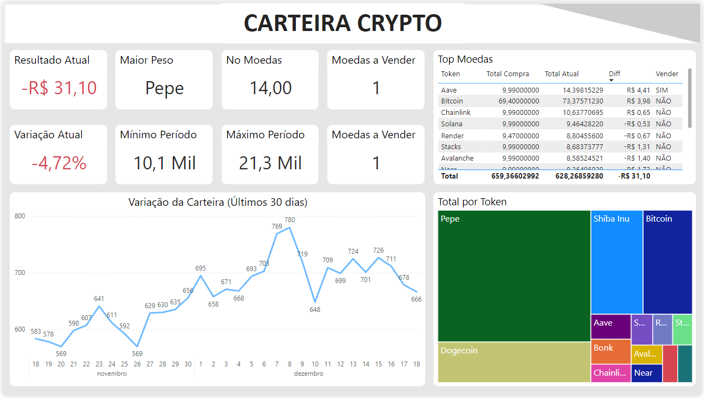

# Dashboard de Criptomoedas - Projeto Power BI

Este projeto foi desenvolvido para analisar dados do mercado de criptomoedas utilizando o Power BI. O objetivo principal é criar um **dashboard interativo** que facilite o acompanhamento de ativos digitais, fornecendo informações úteis para análise de performance, decisões de compra/venda e monitoramento de carteira.

## 🎯 **Objetivo do Projeto**
Demonstrar a aplicação prática do Power BI na criação de um painel analítico focado no mercado de criptomoedas, explorando dados reais ou simulados e extraindo insights estratégicos.

## 📊 **Detalhes do Dashboard**
O dashboard contém as seguintes informações e métricas:
- **Resumo da Carteira**: Quantidade total de cada criptomoeda, valor atual, valor investido e lucro/prejuízo acumulado.
- **Preço Atual e Histórico**: Acompanhamento em tempo real ou simulado dos preços de diferentes ativos.
- **Indicadores de Compra/Venda**: Destaca se uma criptomoeda está em momento favorável para venda, com base em critérios predefinidos.
- **Comparativo de Ativos**: Análise entre diferentes criptomoedas da carteira.
- **Distribuição por Ativo**: Representação visual (gráficos de pizza ou barras) da composição da carteira.
- **Tendências do Mercado**: Evolução de preços em intervalos de tempo personalizados.

## 🔧 **Ferramentas Utilizadas**
- **Power BI**: Para desenvolvimento do dashboard e visualizações interativas.
- **Python**: Para integração com APIs de criptomoedas (ex.: CoinGecko) e preparação de dados.
- **DAX**: Para cálculos avançados e criação de métricas customizadas.
- **APIs de Mercado**: Obtenção de dados atualizados de preços, históricos e volumes de criptomoedas.

## 📁 **Arquivos no Repositório**
- `Dashboard_Crypto.pbix`: Arquivo do Power BI com o projeto completo.
- `Script_API.py`: Script Python para coleta de dados via API.
- `README.md`: Este arquivo explicando o projeto.
- `Dashboard_Cryptomoedas.png`: Captura de tela do dashboard para visualização prévia.

## 🚀 **Como Abrir o Projeto**
1. Certifique-se de que o arquivo `Dados_Criptomoedas.xlsx` ou a API está configurada corretamente.
2. Abra o arquivo `Dashboard_Crypto.pbix` no Power BI Desktop.
3. Atualize os dados para garantir que todas as informações estejam atualizadas.
4. Explore o dashboard e analise os insights gerados.

## 🧠 **Aprendizados**
- Extração de dados em tempo real de APIs de criptomoedas com Python.
- Processamento e transformação de dados no Power BI.
- Criação de KPIs e visualizações otimizadas para análise de investimentos.
- Aplicação de fórmulas DAX para cálculos de lucro, prejuízo e tendências.

## 🌟 **Contribuições**
Este projeto é voltado para aprendizado e portfólio. Feedbacks e sugestões de melhorias são sempre bem-vindos!

---

**Autor:** João Lucas Santos Azevedo  
📧 **Contato:** joaolucasazevedo976@gmail.com
🌐 **LinkedIn:** [João Lucas Santos Azevedo](https://www.linkedin.com/in/joao-lucas-dados/)
