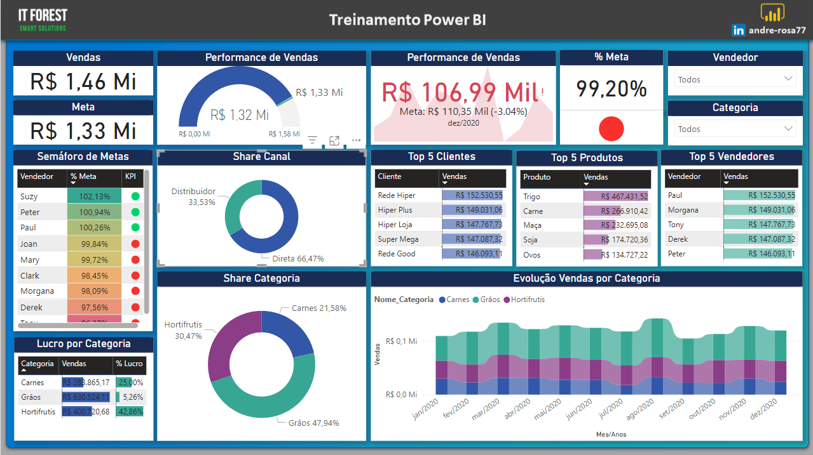

# Dashboard de Vendas - Projeto Power BI

Este é um projeto desenvolvido como parte de um curso de Power BI, com o objetivo de criar um **dashboard interativo** para análise de vendas fictícias. O projeto abrange desde a coleta e tratamento dos dados até a construção de visualizações que facilitam a interpretação de métricas importantes para negócios.

## 🎯 **Objetivo do Projeto**
Demonstrar a aplicação prática das ferramentas e funcionalidades do Power BI na criação de um painel analítico que forneça insights claros e precisos sobre vendas, ajudando na tomada de decisões estratégicas.

## 📊 **Detalhes do Dashboard**
O dashboard inclui as seguintes informações e métricas:
- **Vendas Totais**: Valor total gerado em vendas.
- **Quantidade de Produtos Vendidos**: Número total de itens vendidos.
- **Desempenho por Região**: Análise de vendas agrupadas por região.
- **Top Produtos Vendidos**: Lista dos produtos mais vendidos.
- **Análise Temporal**: Comparativo de vendas por mês, semana ou dia.
- **Margem de Lucro**: Diferença percentual entre receita e custo.
- **Indicadores de Desempenho (KPIs)**: Destaques para metas atingidas e desempenho em relação ao período anterior.

## 🔧 **Ferramentas Utilizadas**
- **Power BI**: Para desenvolvimento do dashboard e criação de visualizações.
- **Excel**: Base de dados fictícia contendo registros de vendas.
- **DAX**: Uso de fórmulas para cálculos avançados e construção de KPIs.

## 📁 **Arquivos no Repositório**
- `Dashboard.pbix`: Arquivo do Power BI com o projeto completo.
- `Base_de_Dados.xlsx`: Base de dados fictícia utilizada no projeto.
- `README.md`: Este arquivo, explicando o projeto.
- `Imagens/`: Capturas de tela do dashboard para visualização prévia.

## 🚀 **Como Abrir o Projeto**
1. Baixe o arquivo `Dashboard.pbix` disponível neste repositório.
2. Abra o Power BI Desktop em sua máquina.
3. Carregue o arquivo `.pbix` para explorar o dashboard e as visualizações.

## 🧠 **Aprendizados**
- Criação de relatórios interativos usando Power BI.
- Uso de DAX para cálculos avançados.
- Importação e transformação de dados no Power Query.
- Design e formatação de visualizações para maior clareza e impacto.

## 🌟 **Contribuições**
Este projeto foi desenvolvido para fins educacionais. Sugestões de melhorias ou feedback são bem-vindos!

---

**Autor:** João Lucas Santos Azevedo  
📧 **Contato:** joaolucasazevedo976@gmail.com
🌐 **LinkedIn:** [Seu LinkedIn Aqui](https://www.linkedin.com/in/joao-lucas-dados/)
